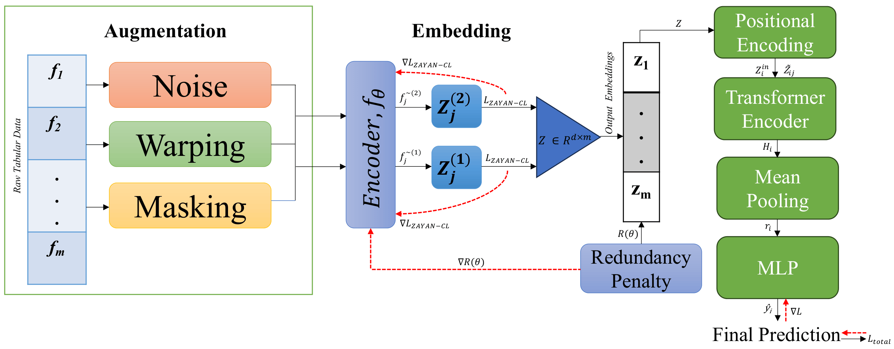

# ZAYAN: Disentangled Contrastive Transformer for Tabular Remote Sensing Data


<p align="center">
  
</p>

ZAYAN is a self-supervised, feature-centric contrastive learning framework for **tabular remote sensing and environmental data**. ZAYAN stands for **Zero-Anchor dYnamic feAture eNcoding**. Rather than applying contrastive learning at the sample or image-patch level, it learns representations at the **feature level**, where each feature is dynamically augmented, encoded, contrasted, and regularized to reduce redundancy. The learned feature embeddings are then used by a Transformer classifier that preserves the contrastive feature geometry for downstream prediction. This design makes ZAYAN especially suitable for heterogeneous tabular sensing data derived from satellite products, GIS layers, environmental indicators, and remote-sensing-driven prediction tasks. Across multiple remote-sensing and environmental tabular benchmarks, ZAYAN achieves strong classification performance, robustness, and generalization compared with classical machine learning, tree ensembles, tabular neural networks, and recent tabular foundation-style baselines.

## Citation

Al Zadid Sultan Bin Habib, Tanpia Tasnim, Md. Ekramul Islam, and Muntasir Tabasum. **“ZAYAN: Disentangled Contrastive Transformer for Tabular Remote Sensing Data.”** In *Proceedings of the 28th International Conference on Pattern Recognition (ICPR)*, Lyon, France, 2026.

BibTeX:
```bibtex
@inproceedings{habib2026zayan,
  title     = {ZAYAN: Disentangled Contrastive Transformer for Tabular Remote Sensing Data},
  author    = {Habib, Al Zadid Sultan Bin and Tasnim, Tanpia and Islam, Md. Ekramul and Tabasum, Muntasir},
  booktitle = {Proceedings of the 28th International Conference on Pattern Recognition},
  year      = {2026},
  address   = {Lyon, France}
}
